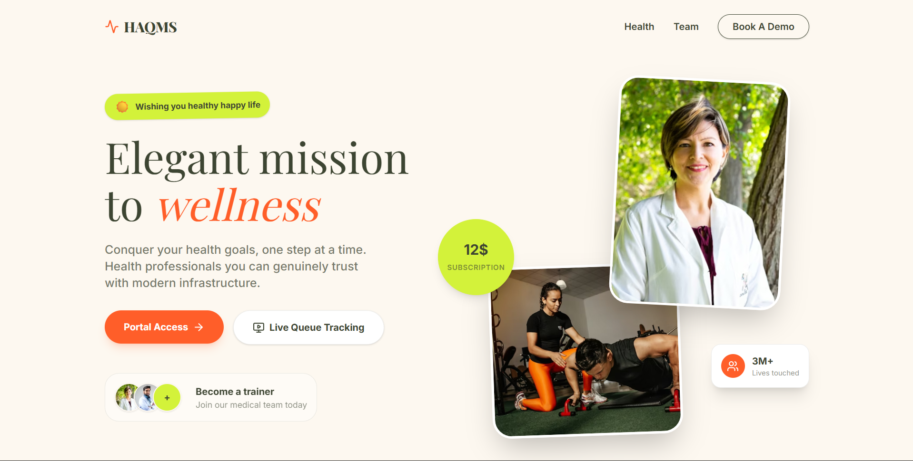

# 🏥 HAQMS

> **H**ospital **A**ppointment & **Q**ueue **M**anagement **S**ystem


Welcome to **HAQMS**! A simple, secure, and modern platform for hospital booking and queue management with a clean UI.

🚀 **[Live Demo](https://haqms-stardust.vercel.app/)**

---

## ✨ What It Does

- 🎟️ **Fast Booking & Queues:** Seamless token generation for receptionists.
- 👨‍⚕️ **Doctor Dashboard:** Simple interface to manage patients and view histories.
- 🔐 **Secure & Reliable:** Role-based access control (RBAC) built-in.

## 🛠️ Tech Stack & Deployment

- 🎨 **Frontend:** Next.js — Deployed on **Vercel** 🔺
- ⚙️ **Backend:** Node.js, Express, Prisma, PostgreSQL — Deployed on **Railway** 🚄

## 🔧 Fixes & Updates

We are constantly improving! Check out the details of what has been fixed and added:  
👉 **[Read the FIXES.md file](./FIXES.md)**

---

## 💻 Getting Started (Local Development)

Easily clone and set up the project locally using **Git**:

```bash
# Clone the repository
git clone https://github.com/TechFigitablLabs/HAQMS.git
cd HAQMS

# Quick installation
chmod +x setup.sh && ./setup.sh

# Start Database
docker-compose up -d

# Setup DB & Run
npm run db:setup --prefix backend
npm run dev
```

_Note: Seeded test accounts are automatically created by the seed script._

---

Made with ❤️ for better healthcare management.
